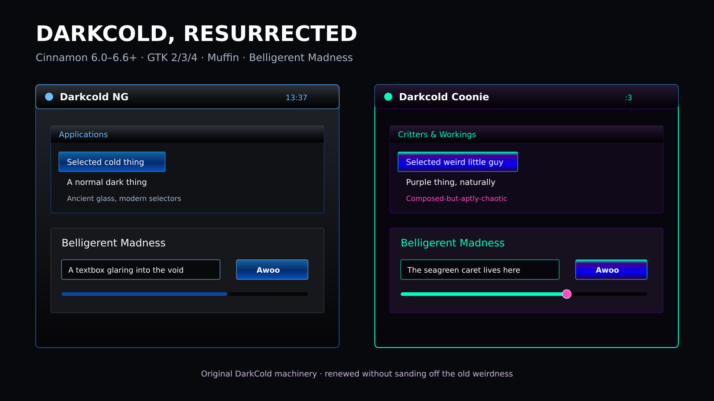

# Coonie's Linux Themes, Icons, Cursors, and App Skins

The live source repository for **Linux and general Theming**: tactile, colorful desktop parts for Coonie's Linux Mint Cinnamon environment. Vista glass, XP structure, DarkCold machinery, bevels, gradients, purple/aqua/pink glow, pictorial icons and weird old-school details are intentional.



## Work directly in the checkout

| Component | Editable and installable files | Build or install |
| --- | --- | --- |
| DarkCold Coonie 2.2.2 | `themes/darkcold-coonie/src/`, `assets/`, and complete `dist/` | `cd themes/darkcold-coonie && make build && ./install.sh` |
| Aero Hoard 1.1.2 | `icons/coonie-aero-hoard/Coonie-Aero-Hoard/` — all 115,933 PNG/SVG/XPM icon paths | `bash icons/coonie-aero-hoard/install.sh --user` |
| Aero Gel cursors | `cursors/coonie-aero-gel-v1/Coonie-Aero-Gel/` and `source-build/` | See the component README |
| Coonieglass ChatGPT skin | `userstyles/Coonieglass-ChatGPT.user.css` | Install with Stylus |
| Project guidance and provenance | `docs/`, `AGENTS.md`, component manifests and licenses | Read before visual changes |

**No release extraction or donor checkout is needed for ordinary editing, installation, packaging, or CI.** Images, fonts and cursor binaries are source assets here. The files under `releases/` are historical witnesses and optional downloads.

## Validate and package

Python 3, Pillow, ripgrep and `gtk-update-icon-cache` are required for the combined checks. Debian packaging additionally needs `dpkg-deb`; component README files cover optional build tools.

```bash
python3 scripts/validate_repository.py
bash themes/darkcold-coonie/tools/test.sh
python3 icons/coonie-aero-hoard/scripts/audit_theme.py icons/coonie-aero-hoard/Coonie-Aero-Hoard --report /tmp/coonie-icon-audit.md
bash icons/coonie-aero-hoard/scripts/build-release.sh
```

The validator checks actual image presence and SHA256 against the per-directory provenance records, icon index directories, DarkCold assets, cursor aliases and UserCSS metadata. A summary claiming 100,000 icons cannot substitute for the artwork.

Keep icon provenance in `Coonie-Aero-Hoard/manifest/icons/` in sync with intentional asset edits. Existing rows document the recovered 1.1.2 witness; record subsequent changes and their provenance explicitly.

## Continuity and target

Linux Mint 21.3, Cinnamon 6.0.x and Nemo are the primary runtime target. Read `docs/COMPONENT-MATRIX.md`, `docs/REGRESSION-CHECKLIST.md`, and `AGENTS.md`. Static and CI checks do not establish that the known huge-Nemo-icon defect is fixed on Coonie's machine.

The source recovery and connector test are documented in `docs/SOURCE-RECOVERY.md`. `STATUS.md` records remaining gaps.
