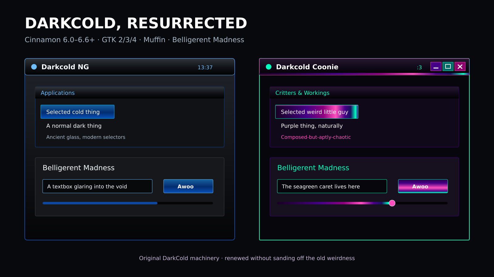

# Darkcold NG + Darkcold Coonie

A maintained, integrated continuation of OriginalSeed's DarkCold aesthetic for modern Linux Mint Cinnamon.



The package contains two complete variants:

- **Darkcold-NG** keeps the original black, graphite, glass, and cold electric-blue character.
- **Darkcold-Coonie** rebuilds the accents around Coonie's recurring palette: deep purple `#460087`, seagreen/aqua `#00ffbf`, hot pink `#ff4fbf`, and a narrow indigo/blue transition. Its rule is simple: dark-bisexual application chrome, aquacoonie electrical accents.

Both variants include:

- Cinnamon shell styling for Cinnamon 6.0 through 6.6+, including Mint 21.3 and 22.3 selectors
- original image-backed GTK 2 and GTK 3/3.20 application chrome, including the etched rules, glass gradients, compact controls, and square bevels
- GTK 4/libadwaita compatibility colors (reversible, opt-in)
- Metacity/Muffin window decorations
- optional inherited icon-theme shims using the Mint-Y family; the installer leaves your current icon theme untouched unless you explicitly pass `--icons`
- Plank, Firefox chrome, and terminal-palette extras
- Belligerent Madness with a Fontconfig fallback family, so missing glyphs fall through to Noto/DejaVu Sans
- reversible settings application, uninstall, diagnostics, reproducible builds, and CI validation

## Install

Extract the release, open a terminal in the extracted folder, and choose one:

```bash
./install.sh --apply darkcold
```

```bash
./install.sh --apply coonie
```

For the GTK 4/libadwaita compatibility layer as well:

```bash
./install.sh --apply coonie --gtk4
```

The installer is per-user and needs no `sudo`. It installs both variants, then applies the selected one. Existing same-named theme directories are moved into a timestamped backup beneath `~/.local/state/darkcold-ng/backups/`.

Useful alternatives:

```bash
./install.sh                    # install both, apply neither
./install.sh --no-font          # leave desktop fonts alone
./apply.sh darkcold             # switch later
./apply.sh coonie --gtk4        # switch and manage GTK 4 overrides
./apply.sh coonie --icons       # only if you explicitly want the packaged icon shim
./doctor.sh                     # verify the installed modules
./uninstall.sh                  # restore saved settings and remove the package
```

The first application records the relevant Cinnamon/GNOME settings. `uninstall.sh` restores those original values. Icon settings are neither changed nor claimed by default, and uninstall will not overwrite a separately selected icon theme. If GTK 4 compatibility replaces an existing `~/.config/gtk-4.0/gtk.css`, it saves and restores that file too.

## Coonie glow architecture

The Coonie edition does not use a global blue-to-purple recolor. The original bevel and glass assets are recomposed by component, following SlickCold's state-layer approach:

- focused titlebars, active panel items, selections, scrollbars, and progress fills use a black-violet → purple → hot-pink body, a short indigo shadow, and a narrow seagreen rim over the original black-metal relief
- minimize is purple/pink, maximize is seagreen/sky, restore follows the dark-bisexual ramp, and close is hot-pink/purple
- unfocused chrome keeps a subdued purple/green cast instead of dropping to plain gray
- electric blue remains available for small transitions and terminal color identity, but it no longer anchors application or titlebar glow
- the Cinnamon panel uses Original DarkCold's image-backed button, applet, status, and scrollbar wells, while full-color applet artwork stays unflattened and receives dimensional aqua/pink lighting
- Cinnamon's global `-st-icon-style: regular` rule converts symbolic requests throughout the shell to full-color icon lookups without selecting or modifying an icon theme
- GTK 3 and the optional GTK 4 layer likewise request regular/full-color artwork globally; GTK 2 predates the modern symbolic-icon mechanism

## Compatibility strategy

| Target | Coverage |
| --- | --- |
| Linux Mint 21.3 / Cinnamon 6.0.4 | Legacy selectors and assets retained; modern base avoids relying on 6.6-only behavior |
| Linux Mint 22 / Cinnamon 6.2 | Shared 6.x selectors and dynamic settings detection |
| Linux Mint 22.2 / Cinnamon 6.4 | Shared 6.x selectors and dynamic settings detection |
| Linux Mint 22.3 / Cinnamon 6.6 | Base stylesheet derived from Cinnamon 6.6.9 and extended with DarkCold identity rules |
| Later Cinnamon 6.x/7.x | Unknown selectors are harmless; the installer probes schemas and keys rather than assuming they exist |

“Future proof” here means the package does not pin itself to a single Cinnamon version, uses current theme metadata, keeps old and new selector families together, avoids replacing system files, and ships a source/build/test path. No third-party theme can promise that a future incompatible Cinnamon or libadwaita release will need zero maintenance.

GTK 4 and libadwaita deliberately do not honor classic GTK themes in the same way as GTK 3. The optional layer sets supported named colors and a restrained set of widget rules; it is isolated and reversible rather than silently modifying your config.

## Belligerent Madness

Belligerent Madness is intentionally the applied interface/document/titlebar font by default. The package defines a composite family called **Darkcold Belligerent**:

1. Belligerent Madness for the delightfully hostile Latin glyphs it has.
2. Noto Sans, then DejaVu Sans, for punctuation, symbols, non-Latin scripts, and other missing glyphs.

Use `--no-font` if you want the visuals without changing desktop fonts.

## Optional extras

- Copy `~/.local/share/themes/THEME/extras/plank/dock.theme` into a Plank theme directory.
- Merge `extras/firefox-userChrome.css` into your Firefox profile's `chrome/userChrome.css` after enabling `toolkit.legacyUserProfileCustomizations.stylesheets`.
- `extras/terminal-palette.txt` provides exact colors for terminal profile creation.

## Build and test

Prebuilt output is committed under `dist/`; users do not need build dependencies. Rebuilding the Coonie image chrome requires Python 3 and Pillow:

```bash
python3 -m pip install pillow
./tools/build.py --clean
./tools/test.sh
./tools/package.sh
```

`tools/build.py` also accepts `--variant darkcold` or `--variant coonie`.

## Lineage and license

This is a GPL-2.0 derivative of DarkCold and SlickCold. Cinnamon's current default theme source informed the 6.6 compatibility base. Belligerent Madness is distributed under the included Font Monkey license. Exact upstream revisions and responsibilities are recorded in [THIRD_PARTY.md](THIRD_PARTY.md).
